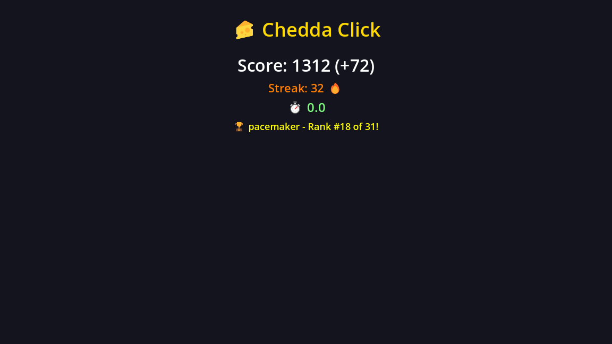

<p align="center">
  
</p>

# 🧀 CheddaBoards for Godot

Simple REST API leaderboards for your Godot games. No backend setup required.

<p align="center">
  
  
</p>

## Install

1. Copy `addons/cheddaboards` to your project
2. **Project → Project Settings → Autoload** → Add `cheddaboards.gd` as `CheddaBoards`
3. Get your API key from [cheddaboards.com](https://cheddaboards.com)

## Usage

```gdscript
func _ready():
    CheddaBoards.set_api_key("cb_your-game_1234567890")
    CheddaBoards.score_submitted.connect(_on_score_submitted)
    CheddaBoards.leaderboard_received.connect(_on_leaderboard_received)

func _on_game_over():
    CheddaBoards.submit_score("player_123", 5000, 10, -1, "PlayerName")

func _on_score_submitted(success: bool, message: String):
    if success:
        CheddaBoards.get_leaderboard(10)

func _on_leaderboard_received(success: bool, entries: Array):
    for entry in entries:
        print("#%d %s - %d" % [entry.rank, entry.nickname, entry.score])
```

## API

### Submit Score
```gdscript
CheddaBoards.submit_score(player_id, score, streak, rounds, nickname)
```
- `player_id` — Unique player identifier (String)
- `score` — Score value (int)
- `streak` — Optional streak/combo (int, default 0)
- `rounds` — Optional rounds played (int, -1 to skip)
- `nickname` — Display name for leaderboard (String, 2-20 chars)

### Get Leaderboard
```gdscript
CheddaBoards.get_leaderboard(limit, sort)
```
- `limit` — Number of entries, 1-1000 (default 100)
- `sort` — `"score"` or `"streak"` (default `"score"`)

### Get Player Rank
```gdscript
CheddaBoards.get_player_rank(player_id, sort)
```

## Signals

| Signal | Parameters |
|--------|------------|
| `score_submitted` | `(success: bool, message: String)` |
| `leaderboard_received` | `(success: bool, entries: Array)` |
| `player_rank_received` | `(success: bool, data: Dictionary)` |
| `request_failed` | `(endpoint: String, error: String)` |

## Response Format

```gdscript
# Leaderboard entry
{ "rank": 1, "playerId": "abc", "nickname": "Player", "score": 5000, "streak": 10 }

# Player rank
{ "rank": 42, "totalPlayers": 1500, "score": 5000 }
```

## Requirements

- Godot 4.x
- CheddaBoards API key

## License

MIT — [CheddaTech Ltd](https://cheddatech.com)
